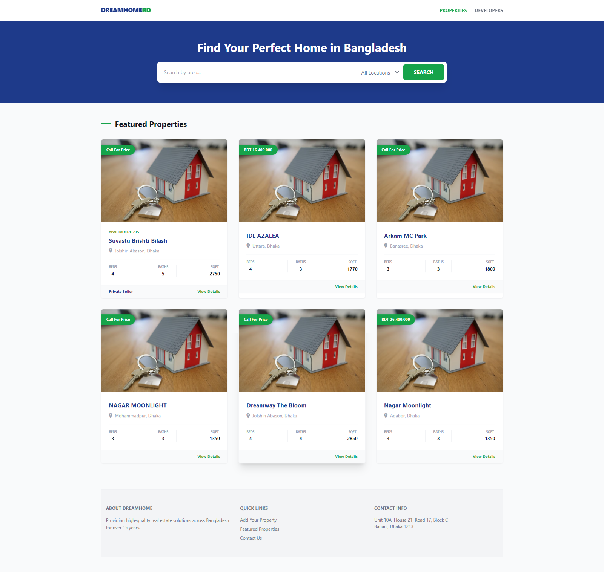
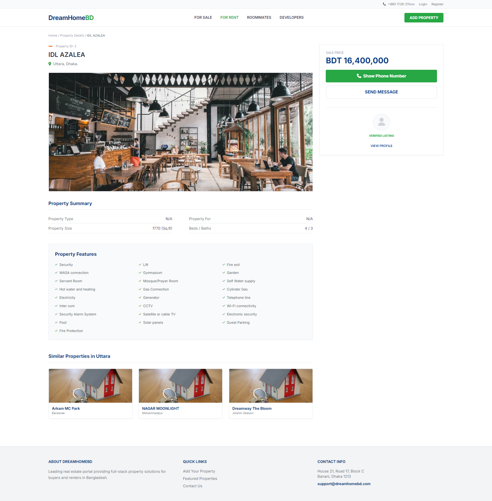
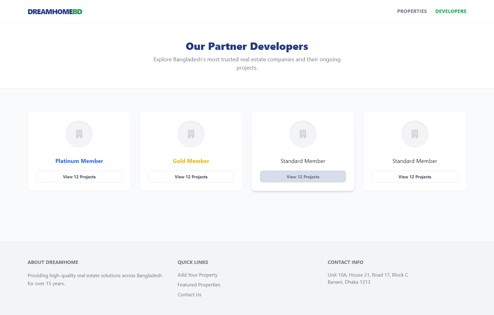

# 🧑‍💼 My Jobs Portal

A comprehensive job and property management platform built with a **Spring Boot backend** and a **Thymeleaf + Tailwind CSS frontend**.  
This project focuses on high-performance industrial layouts and **microservices-ready architecture**.

---

## 🚀 Features

- 🏠 **Property Management**  
  Detailed property listings with owner verification status.

- 🏢 **Developer Directory**  
  A searchable portal for development firms with membership tiering *(Platinum, Gold, etc.)*.

- 📱 **Responsive Design**  
  Built using Tailwind CSS utility classes for a modern, mobile-first experience.

- ⚙️ **Backend Logic**  
  Robust monthly processing for deductions, salary tracking, and job application workflows.

- 🔔 **Infrastructure**  
  Integrated with Docker, Kafka, and RabbitMQ for event-driven notifications.

---

## 📸 Screenshots

### 🏠 Home Page


### 🏘️ Property Details


### 🏢 Developers Portal


> Place your images inside a `screenshots` folder in your project root.

---

## 🛠 Tech Stack

### 🎨 Frontend
- HTML5
- Thymeleaf Template Engine
- Tailwind CSS
- FontAwesome

### ⚙️ Backend
- Java 21 / Spring Boot 3
- Spring Data JPA (PostgreSQL / MySQL)
- Spring Security
- FFmpeg

### 🧱 Infrastructure
- Docker & Docker Compose
- Apache Kafka
- RabbitMQ
- Windows 11

---

## ⚙️ Installation & Setup

### 1️⃣ Clone the Repository
```bash
git clone https://github.com/your-username/my-jobs.git
cd my-jobs
```

### 2️⃣ Configure Database
Edit:
```
src/main/resources/application.properties
```

### 3️⃣ Build Project
```bash
mvn clean install
```

### 4️⃣ Run with Docker
```bash
docker-compose up -d
```

### 5️⃣ Open in Browser
```
http://localhost:8080
```

---

## 📝 License

MIT License
